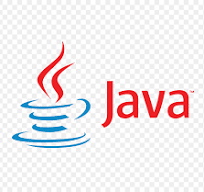
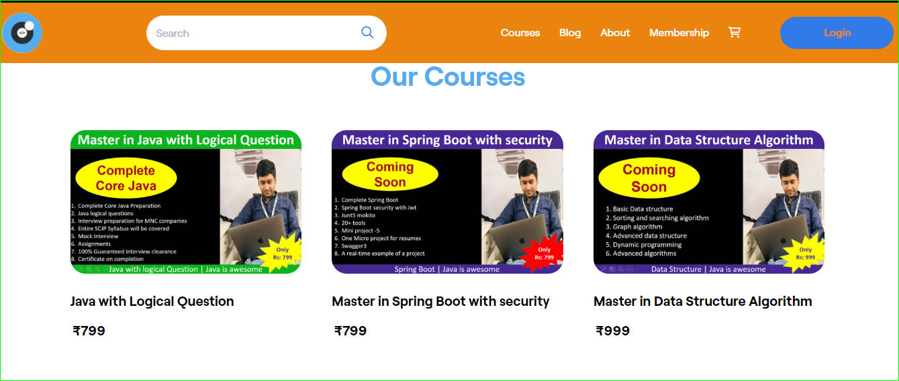

<h1 align="center">Hi 👋, I'm Prince Kumar</h1>
<h3 align="center">Professional Java Fullstack Developer</h3>
<h4 align="center">Senior Software Engineer 💻 Passionate about continuous growth and development.</h4>

  

- 🌱 I’m currently learning React JS and AWS Cloud

- 👨‍💻 All of my projects are available at [https://github.com/Erprincekumarojha](https://github.com/Erprincekumarojha)

- 📝 I regularly create course write articles on [https://javaisawesome.graphy.com/](https://javaisawesome.graphy.com/)

- 📫 How to reach me **pk22cs@gmail.com**

    

## 📚 Blogs Post           |

## ✨GitHub Stats

#### If you find the content is interesting and helpful, use the “Buy me a Coffee” link below to buy me a coffee.

